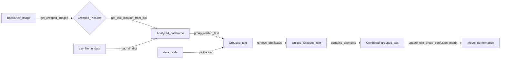

## Explain of each folder and important files:

1. ActivePyTools: Python Libraries that are in using.
2. OldPyscripts: Old Python Libraries and Jupyter files that is not using now.
3. data:
   - excel data preserved for measuring performance and
   - csv file for easy data load.
5. docs:
   - report,
   - hyperparameter tuning loss graph,
   - cropped pictures and
   - detected text on cropped pictures.
6. pics: pictures of bookshelves.
7. bookshelf_scanner_report.ipynb: Jupyter for bookshelf scanner pipeline.
8. test.ipynb: Draft paper.
9. data.pickle: preserved grouped data. list of dict

## FlowChart

> We could Try to use AI to remove noise before `group_related_text` function but after get `Analyzed_dataframe`.
